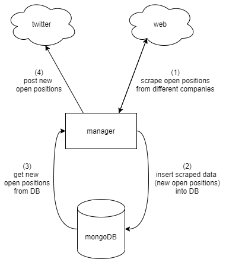

  
   

# jobIL

The software behind the twitter [@jobIL_bot] account.  
This is a partial version, as only 3 scrapers (Apple, Amdocs and Checkpoint) are presented here.  

# What It Does?

Upload new job opportunities from (mostly) Israeli hi-tech companies to twitter [@jobIL_bot] account.

# How It Works?

  </a>

[//]: # ()

   [@jobIL_bot]: <https://twitter.com/jobIL_bot>
